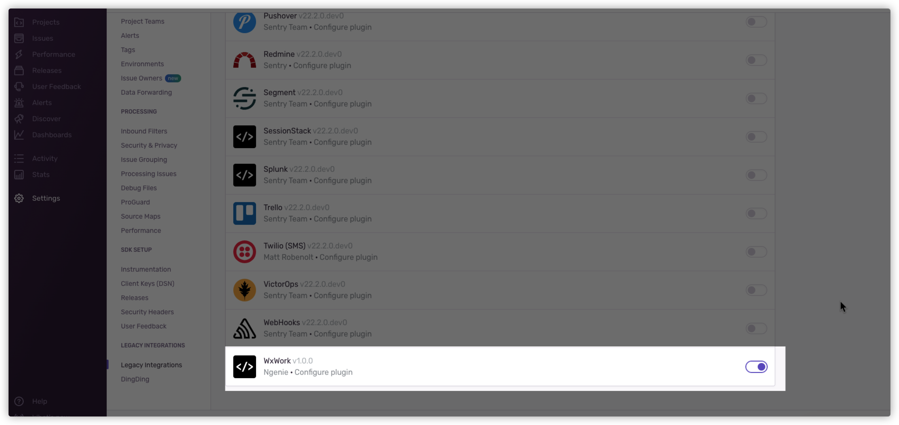

<h1 align="center">Sentry-for-WxWork</h1>
<div align="center">
本项目是模仿<a href="https://github.com/FeSeason/sentry-10-dingding.git">sentry-10-dingding</a>，专为企业微信群聊机器人写的<a href="https://github.com/getsentry/sentry">sentry</a>报警消息插件。
如果你想使用钉钉的机器人作为entry报警的工具，可以去使用sentry-10-dingding。

Languages： English | [中文](README_CN.md)
</div>


# 1 安装
可以修改sentry项目中requirement.txt文件，增加sentry-for-wxwork
```
# requirement.txt

sentry-for-wxwork
```
然后使用以下docker命令重新部署即可
```
# 目前，对于self-hosted版本的开源sentry来说，需要先运行
./install.sh

# 然后再运行
docker-compose up -d 
```
如果是你的sentry服务已经部署好了，依然需要重新运行上面两个命令，才能重新安装好新的插件

# 2 使用
## 2.1 先在整个sentry的Settings里面找到WxWork，如下图所示

## 2.2 然后在可以在你所建的项目的Settings中找到 Legacy integrations, 在里面把WxWork打开

## 2.3 然后刷新一下，可以在你所建的项目中，看到WxWork，接着配置上你的token即可，如下图所示。
注意，这里的token，即为你在配置企微群机器人得到的url中的key的值。
新的版本支持加入项目负责人的名字，方便在群聊中@相关负责人。在企微群聊机器人的key值后面添加，指定该项目的负责人，
方便在群聊中@该负责人，格式为{key}_{name}


# 3 FAQ
如果您在使用过程中，有任何问题，可以给我提交issue


